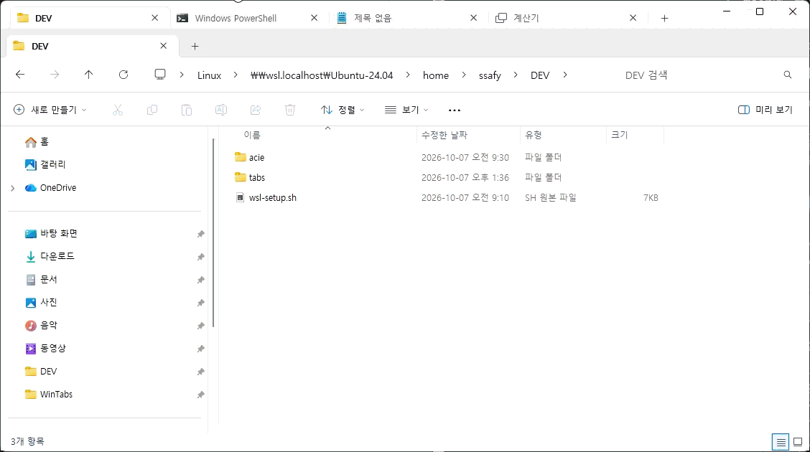

# WinTabs

여러 개의 윈도우 창(파일 탐색기, 명령 프롬프트, 메모장, 터미널 등)을 **Windows 11 파일 탐색기와 똑같이 생긴 탭 창** 하나로 묶어 주는 유틸리티입니다. Stardock Groupy / TidyTabs 와 같은 종류의 프로그램이며, 탐색기가 원래부터 다른 프로그램을 탭으로 담을 수 있는 것처럼 보이도록 만들었습니다.



- WinUI 3 (Windows App SDK) 로 만든 호스트 창: Mica 배경, 타이틀바에 통합된 탐색기 스타일 `TabView`, 시스템 캡션 단추
- 묶인 프로그램은 창 테두리(제목 표시줄)만 제거된 채 탭 스트립 바로 아래에 정확히 붙어서 표시
- 탭 아이콘과 제목은 해당 창의 아이콘/제목을 실시간으로 따라감 (탐색기는 현재 폴더 아이콘)
- 탭 끌어서 순서 변경, 창 밖으로 끌어내면 분리, 다른 WinTabs 창의 탭 스트립에 놓으면 이동
- `Ctrl+Alt+T` : 지금 활성화된 창을 최근에 사용한 WinTabs 창의 탭으로 가져오기
- `Ctrl+1`~`Ctrl+9` : 탭 전환 (그룹이 앞에 있을 때만), 탭의 ✕ 는 프로그램을 닫지 않고 그룹에서 분리

## 동작 원리

창을 다른 프로세스에 재부모(SetParent)하지 않습니다. 대신

1. 대상 창을 호스트 창의 **소유(owned) 창**으로 만들어 항상 호스트 바로 위에 떠 있고, 호스트를 최소화하면 같이 사라지게 합니다. 소유 창은 작업 표시줄/Alt+Tab 에도 따로 나타나지 않습니다.
2. `WS_CAPTION`, `WS_THICKFRAME` 등을 제거해 테두리를 없애고, DWM 둥근 모서리/테두리 색을 끕니다.
3. 대상 창을 호스트의 탭 스트립 **바로 아래** 내용 영역에 정확히 맞춰 배치합니다(겹치지 않음). 아래 모서리는 창 영역(`SetWindowRgn`)으로 Win11 창과 같은 8px 라운드로 깎습니다. 탐색기·메모장·터미널처럼 자체 탭 행을 클라이언트 영역에 그리는 프로그램은 그 행이 우리 탭 스트립 아래에 그대로 보입니다. (창 영역으로 그 행을 잘라내고 스트립과 겹치게 두는 방식은 DWM 이 호스트 창의 XAML 을 그리지 않게 되어 사용하지 않습니다.)
4. 선택되지 않은 탭의 창은 숨깁니다. 호스트 창 이동/크기 변경, 포그라운드 변경, 창 파괴, 제목 변경은 `SetWinEventHook` 으로 추적합니다.
5. 탭을 닫으면 `WM_CLOSE` 를 보내고, 분리하거나 WinTabs 창을 닫으면 저장해 둔 스타일/소유자/영역을 그대로 복원합니다.

## 다운로드

[GitHub Releases](https://github.com/yeseoLee/wintabs/releases) 의 `WinTabs-v*-win-x64.zip` 을 받아 아무 폴더에나 풀고 `WinTabs.exe` 를 실행하면 됩니다. `release` 브랜치에 푸시하면 GitHub Actions(`.github/workflows/release.yml`)가 Windows 러너에서 self-contained 빌드를 만들어 릴리스를 자동 생성합니다. 버전은 `src\WinTabs\WinTabs.csproj` 의 `<Version>` 을 따릅니다.

## 빌드

요구 사항: Windows 10 1809 이상(Windows 11 권장), **.NET 8 SDK**. Visual Studio 는 필요하지 않습니다 (`EnableMsixTooling` 로 Windows App SDK 에 포함된 PRI 도구를 사용).

```powershell
# 저장소 루트에서
.\build.ps1            # dist\WinTabs\WinTabs.exe 로 self-contained 게시
.\build.ps1 -Run       # 게시 후 실행
```

또는 직접:

```powershell
dotnet publish src\WinTabs\WinTabs.csproj -c Release -r win-x64 -p:Platform=x64 --self-contained true -o dist\WinTabs
```

.NET 런타임과 Windows App SDK 런타임이 모두 포함(self-contained)되므로 결과 폴더를 그대로 복사해 사용할 수 있습니다. Visual Studio 2022 에서는 `WinTabs.sln` 을 열면 됩니다.

## 사용법

| 동작 | 방법 |
|---|---|
| 새 탭 열기 | 탭 스트립의 `+` → 파일 탐색기 / 명령 프롬프트 / Windows PowerShell / 터미널 / 메모장 |
| 실행 중인 창 가져오기 | `+` → **열려 있는 창 가져오기** → 창 선택, 또는 그 창에서 `Ctrl+Alt+T` |
| 탭 전환 | 탭 클릭, 또는 `Ctrl+1`~`Ctrl+8` (n번째 탭), `Ctrl+9` (마지막 탭). 그룹 창이나 그 안의 프로그램이 앞에 있을 때만 동작 |
| 탭 분리 | 탭의 ✕, 가운데 클릭, 탭을 창 밖으로 끌어내기, 또는 우클릭 → **새 창으로 분리** (프로그램은 일반 창으로 돌아감) |
| 탭 닫기 | 우클릭 → **탭 닫기** (프로그램 창이 닫힘) |
| 다른 WinTabs 창으로 이동 | 탭을 다른 WinTabs 창의 탭 스트립에 놓기 |
| 새 그룹 창 | `+` → **새 그룹 창**, 또는 `WinTabs.exe` 를 한 번 더 실행 |

명령줄:

```
WinTabs.exe                      # 설정된 시작 탭(기본: 파일 탐색기)으로 새 그룹 창
WinTabs.exe explorer cmd notepad # 최근 사용한 그룹 창에 탭 추가 (실행 중이 아니면 새 창)
WinTabs.exe --new cmd            # 항상 새 그룹 창에 추가
```

## 설정

`%LOCALAPPDATA%\WinTabs\settings.json` (첫 실행 시 생성)

```jsonc
{
  "StartupTab": "explorer",     // 새 그룹 창에 자동으로 여는 탭: explorer | cmd | powershell | terminal | notepad | none
  "CloseWhenEmpty": true,       // 마지막 탭이 닫히면 그룹 창도 닫음 (탐색기와 동일)
  "OnGroupClose": "detach",     // 그룹 창을 닫을 때 묶인 창을 "detach"(일반 창으로 되돌림) 또는 "close"
  "GrabHotkey": true,           // Ctrl+Alt+T 전역 단축키
  "WindowWidth": 1142, "WindowHeight": 637,
  "DebugLog": false,            // %LOCALAPPDATA%\WinTabs\debug.log 에 진단 기록 (환경 변수 WINTABS_DEBUG=1 도 가능)
  "Profiles": [                 // 프로세스 이름 또는 창 클래스별 설정
    { "Match": "explorer.exe", "StripFrame": true },
    { "Match": "Notepad.exe",  "StripFrame": true, "KeepCaption": true },
    { "Match": "WindowsTerminal.exe", "StripFrame": true },
    { "Match": "ConsoleWindowClass",  "StripFrame": true }
  ]
}
```

`StripFrame` 을 `false` 로 두면 그 프로그램은 테두리를 유지한 채 묶입니다. `KeepCaption` 을 `true` 로 두면 테두리를 제거하면서도 `WS_CAPTION` 스타일 비트만 남깁니다. 자체 제목 표시줄을 그리는 프로그램(Windows 11 메모장)은 이 비트가 없으면 창이 비활성화될 때마다 내용이 아래로 밀리고 제목 잔상이 남으므로 기본으로 켜져 있습니다. 처음 보는 프로그램은 자동으로 프로필이 추가됩니다.

## 제한 사항

- 관리자 권한으로 실행된 프로그램의 창은 (UIPI 때문에) 일반 권한의 WinTabs 가 다룰 수 없습니다. WinTabs 도 관리자로 실행하면 됩니다.
- WinTabs 가 비정상 종료되면 묶여 있던 창은 테두리 없는 상태로 남을 수 있습니다. 해당 프로그램을 다시 실행하거나, WinTabs 로 다시 가져온 뒤 분리하면 됩니다.
- 묶인 프로그램에 키보드 포커스가 있을 때 WinTabs 의 탭 전환 단축키(Ctrl+Tab)는 동작하지 않습니다. 탭을 클릭하거나 WinTabs 탭 스트립을 먼저 클릭하세요.
- 탐색기에서 "새 창" 처럼 묶인 프로그램이 스스로 여는 새 창은 자동으로 탭이 되지 않습니다. `Ctrl+Alt+T` 또는 `+` 메뉴로 가져오세요.
- 프레임 제거에 민감한 일부 프로그램(게임, 일부 Electron 앱)은 레이아웃이 어긋날 수 있습니다. 프로필의 `StripFrame` 을 `false` 로 두면 테두리를 유지한 채 묶을 수 있습니다.
- 앱 폴더를 네트워크 경로(`\\wsl$` 등)에서 실행하면 WinUI 런타임을 불러올 수 없으므로, 앱이 자동으로 `%LOCALAPPDATA%\WinTabs\app` 에 복사한 뒤 그곳에서 실행됩니다.

## 프로젝트 구조

```
src/WinTabs/
  Program.cs              단일 인스턴스(AppInstance 리디렉션) 진입점
  App.xaml(.cs)           설정 로드, WinEvent 훅 시작, 명령줄 처리
  MainWindow.xaml(.cs)    그룹 창: 타이틀바 TabView, Mica, 탭/드래그/메뉴/단축키, WinEvent 반응
  Core/CapturedWindow.cs  창 붙이기/배치/영역/숨기기/복원
  Core/WindowTracker.cs   SetWinEventHook 래퍼
  Core/WindowEnumerator.cs 가져올 수 있는 창 목록
  Core/Launcher.cs        프로그램 실행 후 새 창 감지
  Core/IconHelper.cs      HICON → XAML ImageSource
  Core/Settings.cs        settings.json / 앱 프로필
  Interop/NativeMethods.cs Win32 P/Invoke
```
